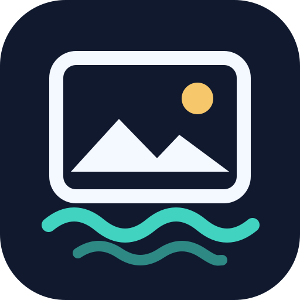

# PhotoHarbor



**Local backup for Google Photos**

PhotoHarbor was previously called Fotoarkiv. Existing Compose service names, image repositories, data folders and internal metadata names are retained for upgrade compatibility.

**v0.2.0-beta.4: single-container edition (amd64).** The portal, per-account workers and sign-in browser run as supervised processes in one container. The previous three-container edition is preserved in [v0.1.0](https://github.com/Bartel1234/fotoarkiv/releases/tag/v0.1.0). This is a beta; a complete Google Photos backup on Unraid still needs real-account validation.

A local web portal for automatic Google Photos backups, with separate accounts, album folders, a media browser and ZIP downloads. The interface defaults to **English**. Use the **🇬🇧 EN / 🇩🇰 DA** buttons at the top of the dashboard or media browser to switch to Danish. The preference is remembered in your browser. Album names, filenames and raw worker logs retain their original language.

PhotoHarbor uses [gphotos-cdp](https://github.com/perkeep/gphotos-cdp), based on [Jake Wharton's Docker image](https://github.com/JakeWharton/docker-gphotos-sync), to operate Google Photos through Chrome. No Google Takeout export is required. Each account has its own browser profile, download position and subfolder under `BACKUP_DIR`.

> Validation: the dashboard, account controls, file organization and media APIs have been tested locally. A complete Google Photos download has not been independently verified against a real account on Unraid. Check the resulting files and counts before treating the archive as complete.

## Installation

Install a Docker Compose plugin on Unraid if `docker compose version` does not work.

1. Extract the project into `/mnt/user/appdata/fotoarkiv-projekt`.
2. Copy `.env.example` to `.env`. Set `APPDATA_DIR`, `BACKUP_DIR` and a strong `APP_PASSWORD` with at least 12 characters. Choose a backup share with sufficient free space.
3. Run from the project folder:

   ```sh
   docker compose up -d
   ```

4. Open `http://YOUR-UNRAID-IP:8787`. Use any username and the password from `.env`.
5. Under **Google Photos accounts**, enter an email address and select **Add account**. Its folder is created under `BACKUP_DIR`.
6. Select **Google sign-in** for the account. A password-protected popup opens the browser on Unraid. Chrome opens Google Photos automatically in the PhotoHarbor login view; no VNC desktop or terminal is needed. Click a Google field to type, or use the text insertion field below it on a phone. Select Finish sign-in when done. Allow extra time on the first launch. If popups are blocked, sign-in opens in the current tab.
7. Sign in, then select **Start backup** in the portal. The sign-in browser closes automatically before the sync worker uses the same profile. **Close sign-in** closes it without starting a backup. Each account has a daily schedule around `SYNC_HOUR`.

### Unraid Docker template (no Community Apps required)

Download [my-fotoarkiv.xml](templates/my-fotoarkiv.xml) into Unraid's user-template directory:

```sh
mkdir -p /boot/config/plugins/dockerMan/templates-user
curl -fL https://raw.githubusercontent.com/Bartel1234/fotoarkiv/v0.2.0-beta.4/templates/my-fotoarkiv.xml -o /boot/config/plugins/dockerMan/templates-user/my-photoharbor-beta4.xml
```

In Unraid select **Docker → Add Container → Template → PhotoHarbor** under user templates. Set a strong portal password and check all four host folders before selecting Apply. The template uses one prebuilt container and exposes only port 8787. Do not overwrite an existing customized template containing your settings. To migrate from Compose, stop its containers first and use exactly the same four host folders; never run both installations against the same profiles.

### Updates through your Unraid stack

For updates without editing the version each time, set `image: ghcr.io/bartel1234/fotoarkiv:beta` and `pull_policy: always` in the existing stack. Use Compose Manager Update, or Compose Pull followed by Compose Up. The beta alias advances only after publishing a release with a verified matching image. Finish active backups first. Keep your existing persistent paths and .env values.

Under Edit Stack → UI Labels, set the fotoarkiv service icon to `https://raw.githubusercontent.com/Bartel1234/fotoarkiv/v0.2.0-beta.4/dashboard/photoharbor-512.png` and WebUI to `http://[IP]:[PORT:8787]/`. Existing user-owned Compose Manager labels are not changed by pulling an image.

### Compose without a local build

The default `compose.yaml` pulls the versioned GHCR image. For a new installation, download the release, copy `.env.example` to `.env`, edit the paths and password, then run `docker compose up -d`. Existing `.env` files and backup folders must be retained when updating.

For an optional build from source:

```sh
docker compose -f compose.yaml -f compose.build.yaml up -d --build
```

## Direct Google sign-in without VNC

The login view streams the container's headed Chrome tab and forwards mouse, keyboard and text input. It uses the same persistent account profiles as before. Chrome debugging listens only on container loopback; only the authenticated PhotoHarbor page is exposed on port 8787. The viewer is tied to the selected account and checks origin and a page token. Opening a second viewer replaces the first. Finish sign-in or Start backup closes Chrome while preserving the session.

This is still a browser-session login, not Google OAuth. Normal Google login and MFA must be validated on your installation; native OS dialogs and device-bound passkeys may not work through the tab view. NoVNC, x11vnc and websockify are removed from the single-container image. A virtual display is retained for headed Chrome.

## Accounts and operation

- The status panel and account cards follow the current stage: preparation, closing sign-in, indexing photos/albums, organizing files, downloading media and stopping. During Google indexing, the panel shows the latest indexed photo and album counts rather than an estimated percentage.
- The dashboard refreshes every eight seconds and shows worker availability, file counts, storage usage, recent files, schedules and activity. Select an account card to view its status and log.
- The **Existing account** keeps its original profile and files in the main backup folder. Additional accounts use folders such as `BACKUP_DIR/user@example.com`. Only add the original account again if you want a separate download starting from the beginning.
- `APPDATA_DIR/chrome` and the account browser profiles contain Google sign-in credentials. Keep them private.
- If a Google session expires, select **Google sign-in** for that account again. Sync normally resumes from its saved position.
- The internal sign-in service listens only on loopback and has no exposed Unraid port. Access it through the portal. Keep port 8787 on your LAN or VPN.
- Browser startup errors appear in `APPDATA_DIR/control/login-browser.log` and `docker compose logs fotoarkiv`. The sign-in popup streams the Chrome tab directly using CDP, without VNC or a remote desktop; signing in through your PC's ordinary browser does not directly provide a session to the sync worker.
- Repeated sign-in requests for an already open account do not queue additional browser launches. Starting backup requests closure and waits for Chrome to release the profile.
- The first download of a large library can take days. Logs are also stored under `APPDATA_DIR/control/accounts/<email>/activity.log`; the original account uses `APPDATA_DIR/control/activity.log`.
- The daily schedule retries after failures. Changing `SYNC_HOUR` requires restarting `fotoarkiv` and takes effect after the next run. Multiple accounts can run concurrently and use substantial CPU, disk and network resources.

The downloader processes the main Google Photos library. Media that exists only in Archive or in shared albums outside the main library is not downloaded yet. Album indexing can discover its metadata, but local album folders contain only downloaded media. PhotoHarbor does not delete anything from Google Photos. Maintain a separate backup of the Unraid folder.

## Remove an account

Select **Remove account** on an email account card. A three-step dialog asks you to choose what happens to its backup files, review the consequences, and type the exact email address plus acknowledge the removal.

- **Keep backup files on the server** leaves the entire account backup folder in place. The Google sign-in profile, schedule and portal cache are removed. The files remain accessible through the Unraid share, but the account is no longer listed in the portal.
- **Delete all backup files for this account** removes that account's backup folder, including photos, videos, album references and metadata, as well as its sign-in profile and schedule. This cannot be undone through the portal.

Removal pauses new operations and waits for explicit confirmation that the sync worker and sign-in browser have stopped. Other accounts continue running. If safe shutdown cannot be confirmed, no files are deleted. Nothing is removed from Google Photos. The original **Existing account**, which shares the main backup directory, cannot be removed through this dialog.

## Scan an incomplete archive

Select **Scan the entire archive** for an account when the local file count is much lower than in Google Photos. The previous position is saved as `APPDATA_DIR/control/accounts/<email>/lastdone-before-rescan` (under `APPDATA_DIR/control` for the original account), and scanning restarts from the oldest part of the timeline.

Existing downloaded files are preserved. Some may be downloaded again and replaced. A full scan can take a long time and requires free space. Avoid opening Google sign-in for the same account while it is running.

The worker waits for the timeline to load and reports an error if navigation stops progressing. A successful exit means it reached the content shown by the web interface; it does not prove completeness. Compare file counts and the oldest years against Google Photos.

## Browse photos, videos and albums

Select **View photos and videos** on an account card. Each account has a separate media page. Choose an album, search filenames, browse thumbnail pages and open photos or videos in the browser. **Download file** downloads an original. Select multiple files and choose **Download selected as ZIP** for a local export.

**Download album** beside the album selector exports every locally available photo and video in the chosen album, including other pages and files excluded by a filename search. The ZIP uses the album title and contains an album folder. It streams directly without a temporary ZIP on the server. The manual selection limits do not apply to complete album exports; allow sufficient download space and time for large albums.

ZIP downloads stream directly to the browser without creating a second complete ZIP on Unraid. Each manually selected ZIP is limited to 500 files and 10 GB; larger selections can be exported in portions. Complete album exports use the separate Download album button. The archive browser reads only local files and uploads nothing to Google. Some media formats cannot be previewed but can still be downloaded. Thumbnails are cached under `APPDATA_DIR/control/thumbnails`. Viewing and downloading require the portal password.

The gallery uses a separate SQLite read index per account under `APPDATA_DIR/control/archive-index`. The first visit builds it; subsequent album switches query only the selected album and page. Catalog changes are checked at least 30 seconds apart, and a full refresh is scheduled on the next visit after five minutes. Refreshes run in the background while the previous complete index remains available. The index is rebuildable and does not modify original media.

## Albums, dates and folder organization

Backup reads Google Photos album membership and photo dates through the saved browser profile. This uses an unofficial read-only web protocol. It does not modify albums or photos in Google. Protocol fields were checked against [Google Photos Toolkit API](https://github.com/xob0t/Google-Photos-Toolkit/blob/main/src/api/api.ts) and its [response parser](https://github.com/xob0t/Google-Photos-Toolkit/blob/main/src/api/parser.ts). PhotoHarbor's implementation is independent and uses only the read methods lcxiM, Z5xsfc and snAcKc.

Each account uses this on-disk layout. Folder names are preserved when changing the interface language:

- `Bibliotek/YYYY/MM/original-name--Google-id.ext`: one primary file per downloaded item. The Google ID prevents collisions between identical filenames.
- `Albums/album-title--album-hash/original-name--Google-id.ext`: locally downloaded members of each album. A short hash distinguishes albums with identical titles.
- `.fotoarkiv/`: album metadata, the authoritative SQLite file catalog and records used to skip already organized downloads.

File modification times use Google's photo timestamp. Year/month folders and displayed Google dates account for Google's timezone offset. EXIF data and media contents are unchanged. Filesystem creation times generally cannot be set to the Google timestamp.

Existing Google-ID folders are organized before and after backup once a complete metadata index is available. **Refresh albums and organize files** on the media page requests organization without downloading media again. Wait for an active backup to finish. Progress appears in the account activity log.

Album files use hard links where supported. Files on different Unraid disks may require verified copies and additional storage. The organization report shows registered album copies. New downloads are organized individually to avoid one folder per photo. Dashboard counts include primary files rather than album references. Existing album files are retained when an album is deleted or renamed in Google Photos.

Organization saves the catalog before removing the old file, rejects symlinks and stops on file conflicts. Interrupted runs can resume. Files without matching Google metadata remain in their original folders and are still shown. Failed or interrupted metadata indexing preserves the previous complete index. Keep a separate backup before large reorganizations.

## Stop a backup

**Stop backup** appears on the account card and its media page while a run is active or pending. It stops the selected account's process group and clears pending requests. Other accounts continue running.

## Versions and installation updates

Always choose a release version rather than downloading the moving `main` branch. Published version tags are retained; fixes receive new version numbers. v0.1.0 is the three-container source release; v0.2.0-beta.1 is the first single-container source release. From v0.2.0-beta.2, a tested versioned image is published at `ghcr.io/bartel1234/fotoarkiv`. Older release files remain available. The build override can build the selected source locally, including stable Chrome at build time.

The single-container image supports **amd64/x86-64** Unraid systems. Chrome's Linux package used here does not support ARM. Port 8787 is the only published port. The internal VNC and web services bind to loopback. A health check probes the authenticated portal, display, login service and worker heartbeats. If a supervised process exits, it restarts inside the container. Restarting or updating the whole container interrupts every active backup; they retain their saved positions.

### Upgrade from v0.1.0 / three containers

Stop or finish active backups first. This command keeps `.env`, `APPDATA_DIR` and `BACKUP_DIR` unchanged. It pulls the new image before stopping the old containers, then removes the old containers without deleting host files or volumes. Existing account profiles and the original account's Chrome profile are reused directly.

```sh
(
set -e
cd /mnt/user/appdata/fotoarkiv-projekt
release_version=v0.2.0-beta.4
update_dir=$(mktemp -d)
trap 'rm -rf "$update_dir"' EXIT
curl -fL "https://github.com/Bartel1234/fotoarkiv/archive/refs/tags/$release_version.tar.gz" -o "$update_dir/source.tar.gz"
mkdir "$update_dir/source"
tar -xzf "$update_dir/source.tar.gz" -C "$update_dir/source" --strip-components=1
cp -a "$update_dir/source/." ./
docker compose pull fotoarkiv
docker compose -f compose.v0.1.yaml down
docker compose up -d fotoarkiv
)
```

Open the portal on the same port and refresh it. You should see **one** `fotoarkiv` container. Check `docker compose ps` and `docker compose logs fotoarkiv`. Sign in again only if the saved Google session expired. The original profile remains at `APPDATA_DIR/chrome`; per-account profiles stay at `APPDATA_DIR/accounts`. Backup folder layout is unchanged. Do not run the old and new containers against the same profiles at the same time.

### Update a single-container installation

Download and extract a chosen release into the project folder, keeping `.env` and host data. Then run:

```sh
docker compose pull fotoarkiv
docker compose up -d --force-recreate fotoarkiv
```

All code and worker scripts are included in the image; there are no source-script bind mounts to update separately. Changes only take effect after pulling and recreating the container.

### Return to the three-container edition

Finish or stop backups, then stop the new container before starting any old workers. Download and extract the v0.1.0 source, keeping `.env`, appdata and media. The included compatibility Compose file can also launch the previous architecture:

```sh
docker compose down
docker compose -f compose.v0.1.yaml up -d --build
```

The compatibility file uses the preserved `dashboard/` and `login/` build definitions. Keep invoking Compose with `-f compose.v0.1.yaml` while using that layout. The exact v0.1.0 release remains available separately.

## Build verification

The GitHub Actions **Single-container build and smoke test** workflow builds the actual image and tests authenticated portal access, login assets, a real VNC WebSocket handshake, account worker startup, Chrome headless startup, media exports, organization and graceful stop. It does not authenticate to Google or verify a complete remote library backup.
